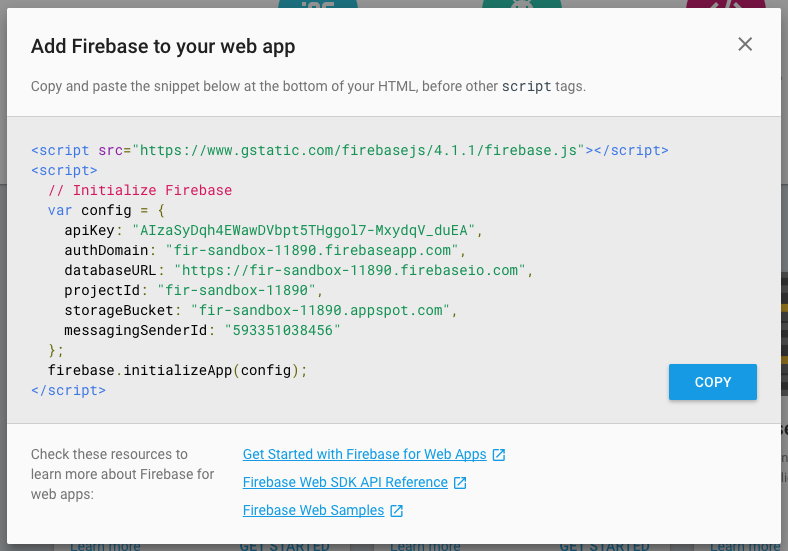

Last week the Firebase team released version 4.1.0 of the JS SDK. This minor version introduces lazy loading of the Firebase SDK.

…Let that sink in

In the words of David East:

](./asset-1.png)

The Firebase JS SDK provides a lot of functionality (Authentication, Realtime Database, Storage, FCM), but providing a simple interface to these powerful APIs comes at a cost, in this specific context, a byte cost (107KB gzip/min to be precise).

Being able to load that 107KB, on an as needed basis, enables developers to build performant experiences, while still getting the benefits of Firebase. To illustrate this, using WebPageTest, I took some comparisons of a simple lazy loading implementation using the [Firebase Web Codelab](https://github.com/firebase/friendlychat/tree/master/web).

_Check out the comparison for yourself_ [_here_](https://www.webpagetest.org/video/compare.php?tests=170602_8T_bd0f3c1838b7f1307d1a3cfaf27c5aea,170602_C7_7f6496bd3239ebaeea37761bc8581530)_._

In this test (testing an emerging market 3g connection), the lazy loaded implementation consistently loads almost a second faster (~0.9 seconds) in **every measured metric**.

_Web page test even made a nice video:_ [_https://www.webpagetest.org/results/video/17/06/02/6f8dde4cdb789bba61dd16bae29ba553511c29ac/video.mp4_](https://www.webpagetest.org/results/video/17/06/02/6f8dde4cdb789bba61dd16bae29ba553511c29ac/video.mp4)

### How Do I Lazy Load Firebase?

If you’ve ever been to the Firebase console, you’ve probably seen the following box before:

This prompt only shows 1 of the 6 javascript files we push to our CDN (i.e. [https://www.gstatic.com/firebasejs/4.1.1/firebase.js](https://www.gstatic.com/firebasejs/4.1.1/firebase.js)). The other 5 files allow you to consume the SDK far more granularly:

-   [https://www.gstatic.com/firebasejs/4.1.1/firebase-app.js](https://www.gstatic.com/firebasejs/4.1.1/firebase.js)
-   [https://www.gstatic.com/firebasejs/4.1.1/firebase-database.js](https://www.gstatic.com/firebasejs/4.1.1/firebase-database.js)
-   [https://www.gstatic.com/firebasejs/4.1.1/firebase-auth.js](https://www.gstatic.com/firebasejs/4.1.1/firebase-auth.js)
-   [https://www.gstatic.com/firebasejs/4.1.1/firebase-storage.js](https://www.gstatic.com/firebasejs/4.1.1/firebase-storage.js)
-   [https://www.gstatic.com/firebasejs/4.1.1/firebase-messaging.js](https://www.gstatic.com/firebasejs/4.1.1/firebase-messaging.js)

firebase-app.js is the only **required** file. It defines the firebase namespace, and provides the hooks for the rest of the components. You can then pick and choose which components you load (i.e. database, auth, storage, messaging) and can load them on demand as needed. Giving developers complete control.

_Take a look at [this JSBin](http://jshcrowthe.jsbin.com/zozuqeh/35/edit?js,console) following JSBin to see this in action._

You can take a look at the source code for the Firebase JS SDK on Github: [https://github.com/firebase/firebase-js-sdk](https://github.com/firebase/firebase-js-sdk)